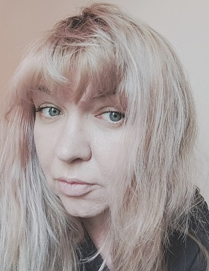

## rs-school cv

# CHURILINA VICTORIA

;

Mobile No.: +79812889227
E-mail: victoria.vlasova2015@gmail.com

My background is more than 10 years experience as a hotelier and hotel's guide. For the last 6 months I am learning front-end and I am starving to success as a web developer. I am in love of design and working hard to be professional in Figma and to get basis of art design.My English level is intermmediate and I am practicing it regularly by reading books as I can talk fluently but my dictonary needed to be improved.

My soft skills are included passion to learn, high sense of responsibility, dedication, attention to details, empathy and communication skills.
My weaknesses are incompetence to delegate the tasks and overthinking.

### Examples of code

```
function multiply(a, b){
return a \* b;
}
```

### My project

;
